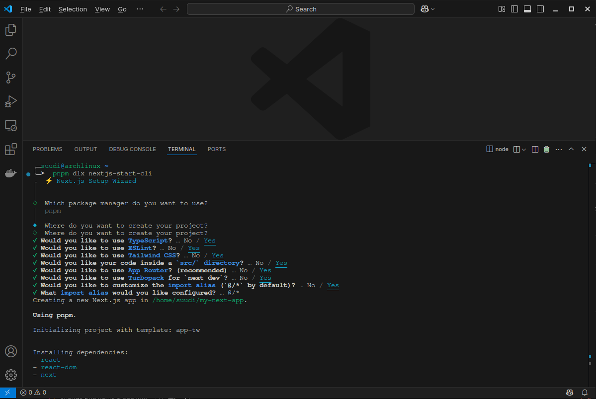

# 🚀 nextjs-start-cli

A beautiful, opinionated CLI tool to scaffold fully-featured Next.js 15+ projects with ease.  
Supports **shadcn/ui**, **Better-Auth**, **Prisma** or **Drizzle**, SQLite setup, multi-package manager support (`pnpm`, `npm`, `bun`) — and all the batteries included!

---

## 🎥 Demo

<p align="center">
    
</p>

## ✨ Features

- ⚡ Fast and interactive setup with [`@clack/prompts`](https://github.com/natemoo-re/clack)
- 📦 Supports `pnpm`, `npm`, and `bun`
- 🎨 Fully configured shadcn/ui
- 🛠️ Choose between Prisma or Drizzle as the database adapter
- 🔐 Authentication powered by Better Auth (pre-integrated)
- 🧩 Modular structure with optional src/ directory support
- 🧱 Prebuilt templates for layout, components, theme provider, and more

---

## 📦 Installation

```bash
# Using pnpm
pnpm dlx nextjs-start-cli

# Using npm
npx nextjs-start-cli

# Using bun
bunx nextjs-start-cli
```

---

## 🧪 What You Get

After running the CLI, you'll get:

- A fresh Next.js app (`app/` directory routing)
- `tailwind.config.ts` and `postcss.config.js`
- `@shadcn/ui` installed and configured with dark/light mode
- Components like `Button`, `DropdownMenu`, `ThemeProvider`, `ModeToggle`
- Optional `Prisma` or `Drizzle` + SQLite setup
- Database schema or config files
- `Latest prisma client setup`
- Optional Database `seeding script`
- Full `Better-Auth` set-up for `client` and `server` components
- Sensible `.gitignore` and initial env scaffolding

---

## 🛠️ Usage

After running the CLI:

```bash
# Start your Next.js project
cd your-project-name
pnpm dev
```

If you chose Prisma:

```bash
pnpm dlx prisma migrate dev
```

If you chose Drizzle:

```bash
pnpm dlx drizzle-kit generate
```

---

## 📦 Tech Stack

- [Next.js 15](https://nextjs.org/)
- [TypeScript](https://www.typescriptlang.org/)
- [TailwindCSS](https://tailwindcss.com/)
- [shadcn/ui](https://ui.shadcn.com/)
- [Prisma](https://www.prisma.io/) or [Drizzle](https://orm.drizzle.team/)
- [@clack/prompts](https://github.com/natemoo-re/clack)
- [Better-Auth](https://www.better-auth.com/)

---

## 🙌 Contributing

Contributions, ideas, and feedback are welcome!  
Feel free to open issues or submit pull requests.

---

## 📜 License

MIT © [Abdulfetah Suudi](https://github.com/iamsuudi)

---

## ⭐️ Show your support

If you find this project helpful, consider starring the repo ⭐  
That helps others discover it!
